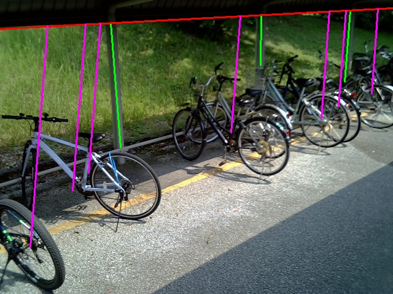

**Advanced Software Engineering Group 4**

*Bicycle parking space availability detection system*
<!-- input image on center -->


# Create server environment
## Docker
1.  Download docker image following command.
    
    ```
    docker pull ktryoma/ase-server:v1
    ```
    After downloading, you can check whether image can be downloaded correctly using `docker images`

2. Create and run a container using `run_docker.sh`
    ```
    ./run_docker.sh
    ```
    In this shell script, the required directory is mounted in docker container, you can access codes and directories in `app`

    if there is no GPU in your computer or not install NVIDIA driver, please run `run_docker_no_gpu.sh`
    ```
    ./run_docker_no_gpu.sh
    ```

    **NOTE** : You have to change the permissions of shell script to executable.
    ```
    chmod +x run_docker.sh
    chmod +x run_docker_no_gpu.sh
    ```

## Anaconda
1. Create conda environment using `requirements_server.txt`
    if you want to use different name of conda environment, please edit `requirements_server.txt` and change the name of environment in the first line.
    ```
    conda env create -f requirements_server.txt
    ```
2. Reinstall torch refer to [torch installation page](https://pytorch.org/get-started/locally/).
    torch==2.6.0 and CUDA 12.6 is used in this project, so please select the version you want to install.

3. Activate the conda environment
    ```
    conda activate <your_environment_name>
    ```


# How to run the program

please run `display.py` following command, and check whether you can access the website `http://localhost:5000`.
```
python display.py
```